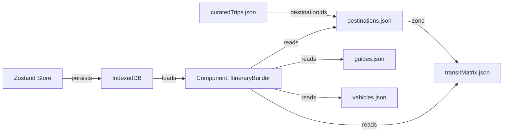

# API Contracts & Data Structures
# BaTour Static Data Layer

**Version:** 1.0.0  
**Type:** Front-End Only (Bundled JSON)  
**Last Updated:** May 2026

---

## Overview

Since BaTour MVP operates without a backend, all data is stored in static JSON files bundled with the application. These files serve as the "API contract" - defining the shape of data that components expect.

**Location:** `src/data/`

**Design Principles:**
1. **Immutability:** Static data never changes at runtime
2. **Predictability:** All fields are required (no optional fields without defaults)
3. **Indonesia-First:** All content in Bahasa Indonesia with Rupiah currency
4. **Offline-Ready:** Total payload < 500KB for fast parsing

---

## Data Files

### 1. `destinations.json`

**Purpose:** Master list of all available destinations in Bandung

**Schema:**
```typescript
interface Destination {
  id: string;                    // Unique identifier (e.g., "dest_001")
  name: string;                  // Display name
  nameEn?: string;               // English name (future i18n)
  category: DestinationCategory; // One of: "Nature", "Culinary", "Shopping", "Culture"
  zone: ZoneId;                  // Geographic zone (for transit calculations)
  description: string;           // Short description (max 200 chars)
  entryFeeIDR: number;           // Entry fee in Rupiah (0 for free)
  estimatedDurationMinutes: number; // Time to spend at location
  rating: number;                // 1.0 - 5.0
  imageUrl: string;              // Relative path (e.g., "/images/destinations/kawah-putih.webp")
  coordinates: {
    lat: number;
    lng: number;
  };
  tags: string[];                // E.g., ["Instagram-worthy", "Family-friendly", "Hiking"]
  bestTimeToVisit: string;       // E.g., "Pagi (07:00-10:00)" or "Siang (12:00-15:00)"
  accessibility: {
    wheelchairAccessible: boolean;
    parkingAvailable: boolean;
    toiletFacilities: boolean;
  };
}

type DestinationCategory = "Nature" | "Culinary" | "Shopping" | "Culture";
type ZoneId = "CityCenter" | "Lembang" | "Ciwidey" | "Dago" | "Cihampelas";
```

**Example:**
```json
{
  "destinations": [
    {
      "id": "dest_001",
      "name": "Kawah Putih",
      "nameEn": "White Crater",
      "category": "Nature",
      "zone": "Ciwidey",
      "description": "Kawah vulkanik dengan air berwarna putih kehijauan yang memukau. Cocok untuk foto dan menikmati udara sejuk pegunungan.",
      "entryFeeIDR": 50000,
      "estimatedDurationMinutes": 120,
      "rating": 4.7,
      "imageUrl": "/images/destinations/kawah-putih.webp",
      "coordinates": {
        "lat": -7.1661,
        "lng": 107.4027
      },
      "tags": ["Instagram-worthy", "Sejuk", "Pemandangan Alam"],
      "bestTimeToVisit": "Pagi (07:00-10:00)",
      "accessibility": {
        "wheelchairAccessible": false,
        "parkingAvailable": true,
        "toiletFacilities": true
      }
    },
    {
      "id": "dest_002",
      "name": "Situ Patenggang",
      "nameEn": "Patenggang Lake",
      "category": "Nature",
      "zone": "Ciwidey",
      "description": "Danau dengan legenda romantis Dewi Rengganis. Tersedia perahu dayung dan spot foto instagramable.",
      "entryFeeIDR": 30000,
      "estimatedDurationMinutes": 90,
      "rating": 4.4,
      "imageUrl": "/images/destinations/situ-patenggang.webp",
      "coordinates": {
        "lat": -7.1559,
        "lng": 107.3780
      },
      "tags": ["Danau", "Perahu", "Romantis"],
      "bestTimeToVisit": "Siang (11:00-15:00)",
      "accessibility": {
        "wheelchairAccessible": false,
        "parkingAvailable": true,
        "toiletFacilities": true
      }
    },
    {
      "id": "dest_003",
      "name": "Farmhouse Lembang",
      "nameEn": "Farmhouse Lembang",
      "category": "Culture",
      "zone": "Lembang",
      "description": "Konsep wisata ala Eropa dengan rumah hobbit, spot foto, dan kafe. Ideal untuk keluarga dan fotografi.",
      "entryFeeIDR": 40000,
      "estimatedDurationMinutes": 120,
      "rating": 4.5,
      "imageUrl": "/images/destinations/farmhouse.webp",
      "coordinates": {
        "lat": -6.8089,
        "lng": 107.6176
      },
      "tags": ["Tema Eropa", "Keluarga", "Kafe"],
      "bestTimeToVisit": "Siang (10:00-16:00)",
      "accessibility": {
        "wheelchairAccessible": true,
        "parkingAvailable": true,
        "toiletFacilities": true
      }
    },
    {
      "id": "dest_004",
      "name": "Floating Market Lembang",
      "nameEn": "Floating Market Lembang",
      "category": "Culinary",
      "zone": "Lembang",
      "description": "Pasar terapung dengan berbagai kuliner khas Sunda. Ada wahana perahu dan taman bunga.",
      "entryFeeIDR": 25000,
      "estimatedDurationMinutes": 90,
      "rating": 4.3,
      "imageUrl": "/images/destinations/floating-market.webp",
      "coordinates": {
        "lat": -6.7884,
        "lng": 107.6151
      },
      "tags": ["Kuliner", "Perahu", "Keluarga"],
      "bestTimeToVisit": "Pagi (08:00-11:00)",
      "accessibility": {
        "wheelchairAccessible": true,
        "parkingAvailable": true,
        "toiletFacilities": true
      }
    },
    {
      "id": "dest_005",
      "name": "Cihampelas Walk",
      "nameEn": "Cihampelas Walk",
      "category": "Shopping",
      "zone": "Cihampelas",
      "description": "Pusat perbelanjaan outdoor dengan factory outlet terkenal. Landmark dengan patung King Kong raksasa.",
      "entryFeeIDR": 0,
      "estimatedDurationMinutes": 150,
      "rating": 4.2,
      "imageUrl": "/images/destinations/ciwalk.webp",
      "coordinates": {
        "lat": -6.8932,
        "lng": 107.6044
      },
      "tags": ["Shopping", "Factory Outlet", "Kuliner"],
      "bestTimeToVisit": "Sore (15:00-20:00)",
      "accessibility": {
        "wheelchairAccessible": true,
        "parkingAvailable": true,
        "toiletFacilities": true
      }
    },
    {
      "id": "dest_006",
      "name": "Dago Dream Park",
      "nameEn": "Dago Dream Park",
      "category": "Nature",
      "zone": "Dago",
      "description": "Taman wisata dengan berbagai spot foto, flying fox, dan pemandangan kota Bandung dari ketinggian.",
      "entryFeeIDR": 35000,
      "estimatedDurationMinutes": 120,
      "rating": 4.1,
      "imageUrl": "/images/destinations/dago-dream.webp",
      "coordinates": {
        "lat": -6.8474,
        "lng": 107.6309
      },
      "tags": ["Pemandangan", "Aktivitas Outdoor", "Foto"],
      "bestTimeToVisit": "Sore (15:00-18:00)",
      "accessibility": {
        "wheelchairAccessible": false,
        "parkingAvailable": true,
        "toiletFacilities": true
      }
    },
    {
      "id": "dest_007",
      "name": "Tebing Keraton",
      "nameEn": "Keraton Cliff",
      "category": "Nature",
      "zone": "Dago",
      "description": "Spot sunrise dan sunset terbaik di Bandung. Pemandangan 360 derajat dari tebing alami.",
      "entryFeeIDR": 15000,
      "estimatedDurationMinutes": 90,
      "rating": 4.8,
      "imageUrl": "/images/destinations/tebing-keraton.webp",
      "coordinates": {
        "lat": -6.8234,
        "lng": 107.6401
      },
      "tags": ["Sunrise", "Hiking", "Fotografi"],
      "bestTimeToVisit": "Pagi (05:00-08:00) atau Sore (16:00-18:00)",
      "accessibility": {
        "wheelchairAccessible": false,
        "parkingAvailable": true,
        "toiletFacilities": false
      }
    },
    {
      "id": "dest_008",
      "name": "Gedung Sate",
      "nameEn": "Sate Building",
      "category": "Culture",
      "zone": "CityCenter",
      "description": "Landmark ikonik Bandung dengan arsitektur kolonial Belanda. Gratis masuk, cocok untuk foto sejarah.",
      "entryFeeIDR": 0,
      "estimatedDurationMinutes": 45,
      "rating": 4.6,
      "imageUrl": "/images/destinations/gedung-sate.webp",
      "coordinates": {
        "lat": -6.9024,
        "lng": 107.6186
      },
      "tags": ["Sejarah", "Arsitektur", "Gratis"],
      "bestTimeToVisit": "Pagi (08:00-11:00)",
      "accessibility": {
        "wheelchairAccessible": true,
        "parkingAvailable": true,
        "toiletFacilities": true
      }
    }
  ]
}
```

---

### 2. `guides.json`

**Purpose:** Available tour guides with contact info and rates

**Schema:**
```typescript
interface Guide {
  id: string;                 // Unique identifier (e.g., "guide_001")
  name: string;               // Full name
  photoUrl: string;           // Profile photo path
  rating: number;             // 1.0 - 5.0
  totalTrips: number;         // Number of completed trips
  languages: string[];        // E.g., ["Bahasa Indonesia", "English", "日本語"]
  specialties: string[];      // E.g., ["Nature Tours", "Photography", "Culinary"]
  dailyRateIDR: number;       // Full-day rate (10+ hours)
  halfDayRateIDR: number;     // Half-day rate (5-6 hours)
  phoneNumber: string;        // WhatsApp-enabled number (format: +62812...)
  bio: string;                // Short bio (max 150 chars)
  verified: boolean;          // BaTour verification status
}
```

**Example:**
```json
{
  "guides": [
    {
      "id": "guide_001",
      "name": "Budi Santoso",
      "photoUrl": "/images/guides/budi.webp",
      "rating": 4.9,
      "totalTrips": 342,
      "languages": ["Bahasa Indonesia", "English"],
      "specialties": ["Nature Tours", "Photography"],
      "dailyRateIDR": 350000,
      "halfDayRateIDR": 200000,
      "phoneNumber": "+6281234567890",
      "bio": "Guide berpengalaman 8 tahun. Spesialis fotografi landscape dan wisata alam Bandung Selatan.",
      "verified": true
    },
    {
      "id": "guide_002",
      "name": "Siti Nurhaliza",
      "photoUrl": "/images/guides/siti.webp",
      "rating": 4.8,
      "totalTrips": 267,
      "languages": ["Bahasa Indonesia", "English", "日本語"],
      "specialties": ["Culinary Tours", "Shopping", "Cultural Sites"],
      "dailyRateIDR": 400000,
      "halfDayRateIDR": 250000,
      "phoneNumber": "+6281298765432",
      "bio": "Berpengalaman dengan wisatawan internasional. Fasih Bahasa Jepang dan suka kuliner lokal.",
      "verified": true
    },
    {
      "id": "guide_003",
      "name": "Ahmad Hidayat",
      "photoUrl": "/images/guides/ahmad.webp",
      "rating": 4.7,
      "totalTrips": 189,
      "languages": ["Bahasa Indonesia", "English"],
      "specialties": ["Adventure Tours", "Hiking", "Off-Road"],
      "dailyRateIDR": 300000,
      "halfDayRateIDR": 180000,
      "phoneNumber": "+6281356789012",
      "bio": "Spesialis adventure dan hiking. Cocok untuk wisatawan yang suka tantangan dan alam bebas.",
      "verified": true
    }
  ]
}
```

---

### 3. `transitMatrix.json`

**Purpose:** Pre-calculated travel times between zones

**Schema:**
```typescript
interface TransitMatrix {
  [fromZone_toZone: string]: number; // Travel time in minutes
}
```

**Calculation Basis:**
- Average driving time during non-peak hours
- Includes buffer for traffic variability (20%)
- No real-time API integration

**Example:**
```json
{
  "transitMatrix": {
    "CityCenter_to_Lembang": 45,
    "CityCenter_to_Ciwidey": 90,
    "CityCenter_to_Dago": 25,
    "CityCenter_to_Cihampelas": 15,
    "Lembang_to_Ciwidey": 120,
    "Lembang_to_Dago": 30,
    "Lembang_to_Cihampelas": 35,
    "Ciwidey_to_Dago": 110,
    "Ciwidey_to_Cihampelas": 95,
    "Dago_to_Cihampelas": 20,
    "Lembang_to_Lembang": 10,
    "Ciwidey_to_Ciwidey": 15,
    "Dago_to_Dago": 10,
    "Cihampelas_to_Cihampelas": 5,
    "CityCenter_to_CityCenter": 0
  }
}
```

**Usage Pattern:**
```javascript
// Component: TimelineEngine.js
const getTransitTime = (fromZone, toZone) => {
  if (fromZone === toZone) return transitMatrix[`${fromZone}_to_${fromZone}`] || 5;
  const key = `${fromZone}_to_${toZone}`;
  const reverseKey = `${toZone}_to_${fromZone}`;
  return transitMatrix[key] || transitMatrix[reverseKey] || 60; // Default 1hr if missing
};
```

---

### 4. `vehicles.json`

**Purpose:** Available vehicle types and pricing

**Schema:**
```typescript
interface Vehicle {
  id: string;                 // E.g., "vehicle_car" or "vehicle_van"
  type: "Car" | "Van";
  capacity: {
    min: number;              // Minimum passengers
    max: number;              // Maximum passengers
  };
  dailyRateIDR: number;       // 10+ hours
  halfDayRateIDR: number;     // 5-6 hours
  features: string[];         // E.g., ["AC", "Audio System", "USB Charging"]
  imageUrl: string;
}
```

**Example:**
```json
{
  "vehicles": [
    {
      "id": "vehicle_car",
      "type": "Car",
      "capacity": {
        "min": 1,
        "max": 4
      },
      "dailyRateIDR": 600000,
      "halfDayRateIDR": 400000,
      "features": ["AC", "Audio System", "USB Charging", "Child Seat Available"],
      "imageUrl": "/images/vehicles/car.webp"
    },
    {
      "id": "vehicle_van",
      "type": "Van",
      "capacity": {
        "min": 5,
        "max": 8
      },
      "dailyRateIDR": 900000,
      "halfDayRateIDR": 600000,
      "features": ["AC", "Audio System", "USB Charging", "Extra Luggage Space"],
      "imageUrl": "/images/vehicles/van.webp"
    }
  ]
}
```

---

### 5. `curatedTrips.json`

**Purpose:** Pre-designed itineraries for quick booking

**Schema:**
```typescript
interface CuratedTrip {
  id: string;
  name: string;
  description: string;
  thumbnailUrl: string;
  duration: "Half Day" | "Full Day";
  destinationIds: string[];   // References to destinations.json
  suggestedVehicle: "Car" | "Van";
  estimatedTotalCostIDR: number;
  tags: string[];
  difficulty: "Easy" | "Moderate" | "Challenging";
}
```

**Example:**
```json
{
  "curatedTrips": [
    {
      "id": "curated_001",
      "name": "Ciwidey Highland Escape",
      "description": "Jelajahi Kawah Putih dan Situ Patenggang dalam satu hari. Cocok untuk pecinta alam dan fotografi.",
      "thumbnailUrl": "/images/curated/ciwidey-escape.webp",
      "duration": "Full Day",
      "destinationIds": ["dest_001", "dest_002"],
      "suggestedVehicle": "Car",
      "estimatedTotalCostIDR": 1150000,
      "tags": ["Nature", "Photography", "Cool Weather"],
      "difficulty": "Easy"
    },
    {
      "id": "curated_002",
      "name": "Lembang Family Fun",
      "description": "Trip keluarga dengan kunjungan ke Farmhouse dan Floating Market. Ada wahana anak dan kuliner.",
      "thumbnailUrl": "/images/curated/lembang-family.webp",
      "duration": "Full Day",
      "destinationIds": ["dest_003", "dest_004"],
      "suggestedVehicle": "Van",
      "tags": ["Family", "Culinary", "Kids-Friendly"],
      "difficulty": "Easy"
    },
    {
      "id": "curated_003",
      "name": "Sunrise Chaser",
      "description": "Mulai pagi di Tebing Keraton untuk sunrise, lanjut ke Dago Dream Park. Untuk adventure seeker.",
      "thumbnailUrl": "/images/curated/sunrise.webp",
      "duration": "Half Day",
      "destinationIds": ["dest_007", "dest_006"],
      "suggestedVehicle": "Car",
      "estimatedTotalCostIDR": 750000,
      "tags": ["Adventure", "Sunrise", "Hiking"],
      "difficulty": "Moderate"
    }
  ]
}
```

---

## Data Relationships



---

## Validation Rules

### On Application Load
```javascript
// utils/validateStaticData.js
export const validateDestinations = (data) => {
  const required = ['id', 'name', 'category', 'zone', 'entryFeeIDR', 'estimatedDurationMinutes'];
  
  return data.destinations.every(dest => 
    required.every(field => dest[field] !== undefined)
  );
};

export const validateTransitMatrix = (destinations, transitMatrix) => {
  const zones = [...new Set(destinations.map(d => d.zone))];
  const requiredPairs = zones.flatMap(z1 => 
    zones.map(z2 => `${z1}_to_${z2}`)
  );
  
  const missingPairs = requiredPairs.filter(pair => 
    !(pair in transitMatrix) && !(pair.split('_to_').reverse().join('_to_') in transitMatrix)
  );
  
  if (missingPairs.length > 0) {
    console.warn('Missing transit matrix entries:', missingPairs);
  }
  
  return missingPairs.length === 0;
};
```

---

## Mock Data Generation Guidelines

**For Development/Testing:**
1. **Realistic Pricing:**
   - Entry fees: Rp 15.000 - Rp 50.000
   - Guide daily rate: Rp 300.000 - Rp 500.000
   - Vehicle daily: Rp 600.000 (car), Rp 900.000 (van)

2. **Image Placeholders:**
   - Use Unsplash API or local placeholder images
   - Naming convention: `{destination-slug}.webp`
   - Dimensions: 800x600px (4:3 aspect ratio)

3. **Ratings:**
   - Distribution: 70% rated 4.5+, 20% rated 4.0-4.4, 10% below 4.0
   - Use 1 decimal place (e.g., 4.7, not 4.73)

4. **Text Content:**
   - Descriptions: 100-200 characters (mobile-friendly)
   - Guide bios: 80-150 characters
   - Use casual, friendly Bahasa Indonesia tone

---

## Future API Migration Path

When transitioning to a real backend:

**Phase 1: Hybrid (Read from API, fallback to static)**
```javascript
const fetchDestinations = async () => {
  try {
    const response = await fetch('/api/destinations');
    return await response.json();
  } catch {
    return import('../data/destinations.json'); // Fallback
  }
};
```

**Phase 2: Full Backend**
- Replace JSON imports with API calls
- Add authentication layer
- Implement real-time availability checks
- Add user-generated content (reviews, photos)

**Migration Checklist:**
- [ ] API endpoints mirror JSON structure
- [ ] Client-side validation remains
- [ ] Service Worker caches API responses
- [ ] Error states for network failures
- [ ] Loading skeletons for async data

---

**Document Control:**
- **Created:** May 13, 2026
- **Last Updated:** May 13, 2026
- **Next Review:** Before Phase 2 backend integration
